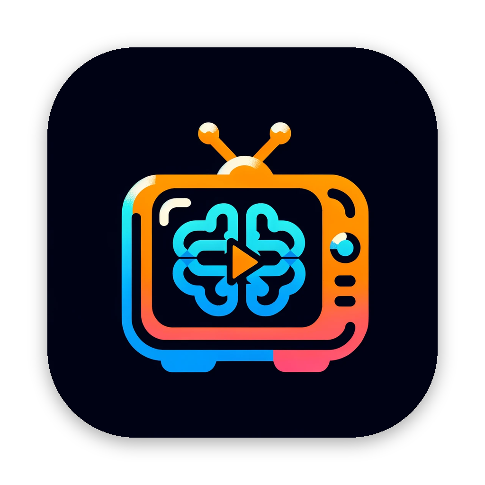

<div align="center">



# BTVReplay

**Synchronized replay of intracranial EEG and patient video for epilepsy monitoring review.**

[-black?logo=unity&logoColor=white)](https://unity.com/releases/editor/whats-new/6000.4.10) [](#requirements) [](https://github.com/CRNL-Eduwell/BTVReplay/releases) [](LICENSE)

</div>

---

BTVReplay (*BrainTV Replay*) is a desktop application for reviewing intracranial EEG (SEEG)
recordings alongside the synchronized patient video used in epilepsy monitoring units. It draws
EEG traces, renders a 3D brain (MNI template or patient meshes) with per-electrode activity,
computes time-frequency maps and inter-channel correlations, and keeps everything locked to a
single video clock so signal and behaviour can be read together.

It is used for clinical epilepsy monitoring review and research.

> [!NOTE]
> **Research / clinical-review tool — not a certified medical device.** BTVReplay is for visual
> review and research; it is not intended for primary diagnosis. This repository contains **no
> patient data**: the bases under `Assets/Config/PatientBase/` are synthetic fixtures.

<!-- Add a hero screenshot here once captured, e.g.:   -->

## Features

- **Video-locked EEG playback** — the video (or a synthetic clock when no video exists) is the
  master timeline; traces, brain and analyses redraw from it every frame.
- **EEG traces** — multiple files/montages, gain/offset/window controls, per-channel navigation,
  on-trace event annotation.
- **3D brain** — MNI template or patient meshes (`.tri` / `.gii`), electrode spheres coloured by
  signal, switchable referentials (MNI / patient / electrodes-only).
- **Time-frequency & correlation** — STFT maps, z-score normalization, 1D/2D Pearson correlation
  across channels, computed off the main thread.
- **Montages** — build derived montages from channel expressions.
- **Events & protocols** — load/save event marks (`.pos` / `.btv`), behavioural protocols
  (`.prov`), code-matching.
- **Audio sonification** — map a channel's amplitude to pitch; extract/filter audio from the video.
- **Patient database** — manage subjects, experiments and anatomy across portable patient bases.

## Supported formats

| Kind | Formats |
|------|---------|
| EEG  | Elan, Micromed (`.TRC`), BrainVision, EDF |
| Anatomy | meshes `.tri` / `.gii`, points `.pts`, transforms `.trm` |
| Events  | `.pos`, `.btv` |
| Database | `.dbtv2` (JSON; migrated from legacy `.txt` / `.dbtv`) |

EEG samples are read natively through the in-house **EEGFormat** library; FFT/correlation use
FFTW3 and an in-house signal-processing library.

## Requirements

- **Unity 6.4 (6000.4.10f1)** to open or build from source.
- A desktop platform: **Windows x86-64**, **Linux x86-64**, or **macOS (Apple Silicon / arm64)**.
- *Optional:* a system install of **VLC** — only needed for extracting/recording audio from video
  (configure its location in the database options if it is not on the default path).

Native plugins ship per-platform under `Assets/Plugins/` (`Windows-x86_64/`, `Linux-x86_64/`,
`macOS-arm64/`). There are no Intel-Mac binaries.

## Getting started

### Run a build

Grab the build for your platform from the [latest release](https://github.com/CRNL-Eduwell/BTVReplay/releases),
unzip, and launch. The `Config` folder ships next to the executable.

### Build from source

```bash
git clone https://github.com/CRNL-Eduwell/BTVReplay.git
```

1. Open the project in **Unity 6.4 (6000.4.10f1)** (the single scene is `Assets/_main.unity`).
2. Use the **BTVReplay → Build** editor menu to produce a Windows, Linux, or macOS-arm64 build;
   it copies `Assets/Config` next to the output.

### Make data portable across machines

Patient bases store file paths as portable tokens (`${NAME}/...`). Configure the named roots once
per machine in the database manager's **options** so the same base resolves on a clinical share,
a laptop, or a workstation without editing the files. The bundled MNI assets resolve automatically.

## Project layout

```
Assets/
  _main.unity              Single scene
  Scripts/
    Data/                  Persistence: subject DBs, EEG file infos, events, workspaces
    Services/              Global state: EEG slots, events, traces, calculations, loading
    Messenger/             Typed pub/sub message bus
    Brain/                 Runtime meshes + electrode rendering
    Traces/                LineRenderer EEG traces
    VideoPlayer/           Master video clock (Unity player / ghost clock)
    UI/                    Toolbars, windows, docking
  Plugins/                 Per-platform native libraries (+ Managed/ for Json.NET)
  Config/                  Atlases, MNI meshes, sounds, protocols, test bases
```

## Contributing

- Work on feature branches off **`develop`**; open pull requests against `develop`. `master` is
  the release branch (updated by merging `develop`).
- Commit messages follow `type: short description` (`feat:`, `fix:`, `docs:`, `refactor:`,
  `build:`, `perf:`, `chore:`).
- Edit-mode tests live in `Assets/Scripts/Editor/Tests/` and run via the Unity Test Runner; please
  add or update tests with behavioural changes.
- Line endings are normalized by `.gitattributes` (LF in the repository, native on checkout).
  Reformat-only commits are listed in `.git-blame-ignore-revs`; to have local `git blame` skip
  them: `git config blame.ignoreRevsFile .git-blame-ignore-revs`.

### Merging scenes and prefabs

Scenes and prefabs are YAML, and git's text merge often conflicts on changes Unity's Smart Merge
(`UnityYAMLMerge`, shipped with the editor) resolves on its own. Set it up once per clone as a
git mergetool (macOS path shown; on Windows it is `Editor\Data\Tools\UnityYAMLMerge.exe` in the
editor install):

```bash
git config merge.tool unityyamlmerge
git config mergetool.unityyamlmerge.trustExitCode false
git config mergetool.unityyamlmerge.cmd "'/Applications/Unity/Hub/Editor/6000.4.10f1/Unity.app/Contents/Helpers/UnityYAMLMerge' merge -p \"\$BASE\" \"\$REMOTE\" \"\$LOCAL\" \"\$MERGED\""
```

Then, when a merge stops on a scene or prefab conflict, run `git mergetool`. Conflicts Smart
Merge cannot settle open in a fallback GUI tool (FileMerge on macOS, if installed); the list is in
`mergespecfile.txt` next to the tool. It is set up as a mergetool rather than a `.gitattributes`
merge driver on purpose: a driver is handed extension-less temp files, which `UnityYAMLMerge`
does not recognise.

## Acknowledgements

Signal processing uses [FFTW](https://www.fftw.org/).
JSON via [Json.NET](https://www.newtonsoft.com/json).

<div align="center">

<a href="https://www.crnl.fr"></a>
  &nbsp;&nbsp;&nbsp;&nbsp;&nbsp;
  <a href="https://www.chuv.ch"></a>

</div>

## License

Released under the **GNU General Public License v3.0** — see [`LICENSE`](LICENSE).

BTVReplay links FFTW3, which is GPL-licensed; GPLv3 keeps the application compatible with it. The
bundled Json.NET is MIT-licensed. The Framework plugin also links the LLVM OpenMP runtime on macOS
(Apache-2.0 with LLVM exception) and ships GCC's `libgomp` on Linux (GPL with the GCC Runtime
Library Exception).
